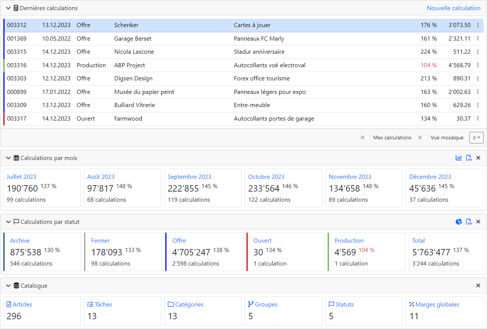

#  Calculation

Programme de calcul basé sur l'environnement de développement Symfony 7.x.

## Licence

Ce programme est distribué avec une [licence propriétaire](LICENSE.md) et une
[politique de confidentialité](POLICY.md).

## Versions

## Qualité du code

## Actions

