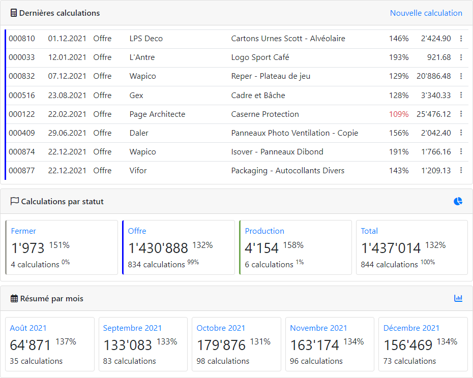

 Calculation
-----------
Programme de calculs basé sur l'environnement de développement Symfony 5.x.

Licence
-------
Ce programme est distribué avec une [licence propriétaire](LICENSE.md).

Versions
--------
   

Qualité du code
----------------
    

Actions
-------
     

Dernière mise à jour : Janvier 2022

