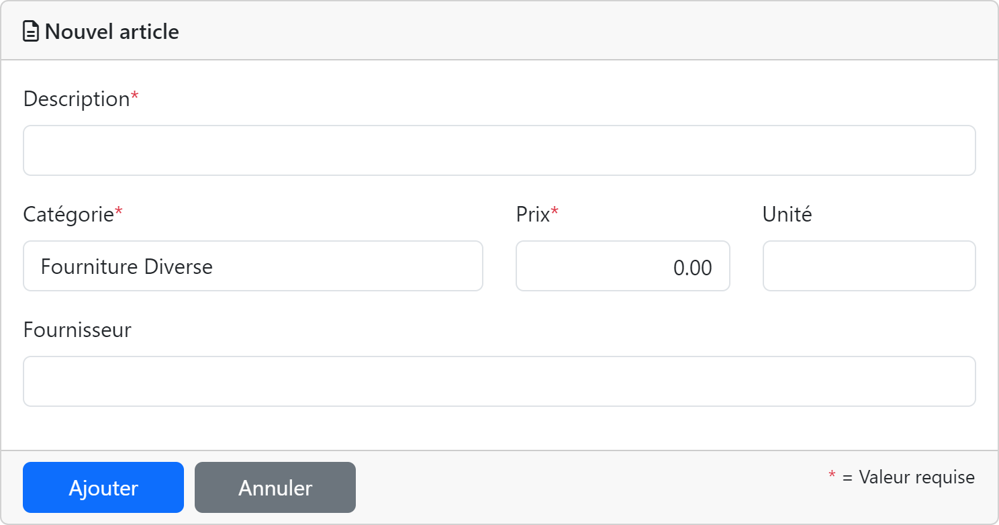

Cette partie du site est utilisée pour la gestion des articles. Les pages suivantes sont disponibles :

[TOC]

# Articles

Affiche la liste des articles.

La table contient les colonnes suivantes :

| Champ       | Description                                                  |
| ----------- | ------------------------------------------------------------ |
| Description | Description de l'article.                                    |
| Catégorie   | Catégorie à laquelle appartient l'article.                   |
| Fournisseur | Nom du fournisseur de l'article.                             |
| Unité       | Unité de l'article.                                          |
| Prix        | Prix unitaire de l'article.                                  |

# Nouvel l'article

Permet de créer un nouvel article.

| Champ       | Type             | Description                                                  | Requis |
| ----------- | ---------------- | ------------------------------------------------------------ | :----: |
| Description | Texte (255)      | Description de l'article.                                    |  Oui   |
| Catégorie   | Liste déroulante | Catégorie à laquelle appartient l'article.                   |  Oui   |
| Prix        | Valeur numérique | Prix unitaire de l'article.                                  |  Oui   |
| Unité       | Texte (30)       | Unité de l'article.                                          |  Non   |
| Fournisseur | Texte (255       | Nom du fournisseur de l'article.                             |  Non   |

| Action  | Description                                                    |
| ------- | -------------------------------------------------------------- |
| OK      | Enregistre les modifications et retourne à la page précédente. |
| Annuler | Annule les modifications et retourne à la page précédente.     |

# Modifier l'article

Permet l'édition d'un article existant.

| Champ       | Type             | Description                                                  | Requis |
| ----------- | ---------------- | ------------------------------------------------------------ | :----: |
| Description | Texte (255)      | Description de l'article.                                    |  Oui   |
| Catégorie   | Liste déroulante | Catégorie à laquelle appartient l'article.                   |  Oui   |
| Prix        | Valeur numérique | Prix unitaire de l'article.                                  |  Oui   |
| Unité       | Texte (30)       | Unité de l'article.                                          |  Non   |
| Fournisseur | Texte (255       | Nom du fournisseur de l'article.                             |  Non   |

| Action  | Description                                                    |
| ------- | -------------------------------------------------------------- |
| OK      | Enregistre les modifications et retourne à la page précédente. |
| Annuler | Annule les modifications et retourne à la page précédente.     |

# Supprimer l'article

Affiche une confirmation pour la suppression de l'article.

| Action    | Description                                             |
| --------- | ------------------------------------------------------- |
| Supprimer | Supprime l'article et retourne à la page précédente.    |
| Annuler   | Annule la suppression et retourne à la page précédente. |

# Propriétés de l'article

Affiche les propriétés de l'article.

| Action    | Description                                  |
| --------- | -------------------------------------------- |
| OK        | Retourne à la page précédente.               |
| Modifier  | Affiche la page d'édition de l'article.      |
| Supprimer | Affiche la page de suppression de l'article. |

